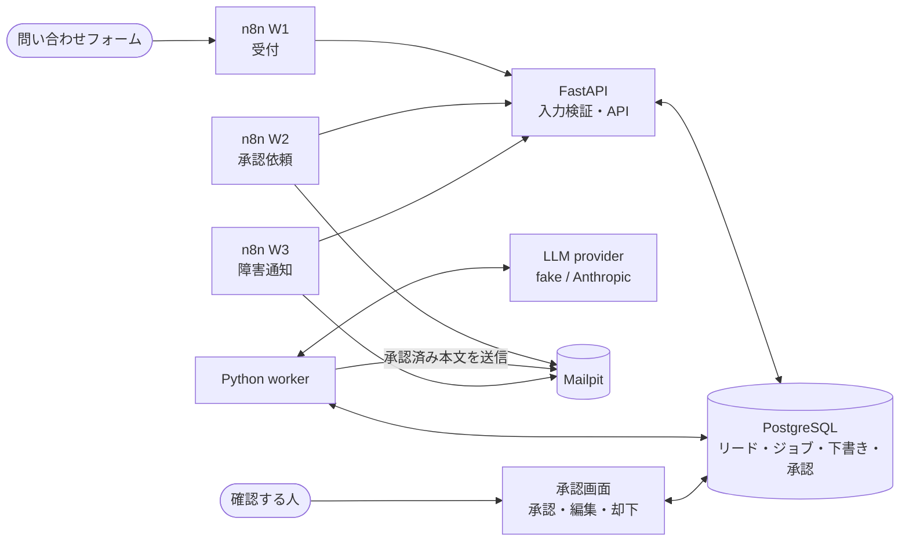
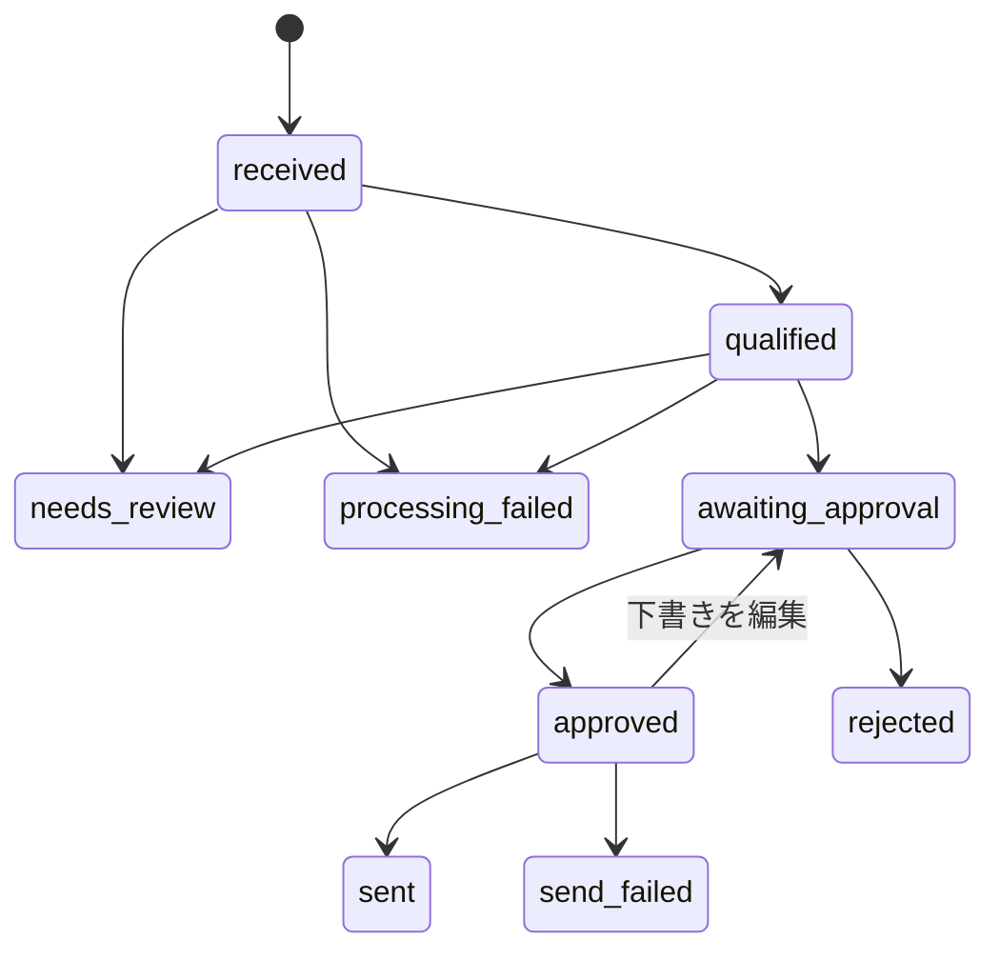

# AI Sales Operations Engine — 日本語ガイド

[English](README.md) | 日本語

**B2Bの問い合わせを受け付け、AIで見込み度を評価し、返信案を作成して、人が承認した本文だけを送信する仕組みです。** ポートフォリオプロジェクトP01として、重複受付、AIの不正な出力、同時処理、障害からの回復まで検証しています。

フォームの入口と通知はn8n、入力検証と業務判断はPython / FastAPI、状態とジョブの保存はPostgreSQLが担当します。メールはローカルのMailpitで受け取り、外部の顧客には送信しません。

| 項目 | 名前 |
|---|---|
| プロジェクトID | P01 |
| プロジェクト名 | AI Sales Operations Engine |
| ポートフォリオ内の識別名 | `p01-lead-automation` |
| Pythonパッケージ | `sales_ops` |

[日本語ケーススタディ](docs/case-study.ja.md)では、課題、設計の理由、検証で見つかった不具合、実測結果を説明しています。

## このプロジェクトで示すこと

- **同じ問い合わせを重複登録しない。** 同じリクエストの再送と同時実行を、DBの制約と冪等性キーで処理します。
- **AIの出力をそのまま信頼しない。** JSONの構造、値の範囲、業務上の規則を検証し、不正な回答は人の確認へ回します。
- **承認した本文と送信する本文を一致させる。** 下書きのSHA-256と承認を結び付け、DBの制約でも確認します。
- **複数workerと障害回復に対応する。** PostgreSQLのジョブキュー、処理権の期限、回数を制限した再試行を使います。
- **失敗する条件と限界を説明する。** SMTP送信直後に停止すると二重送信になる条件も、テストで再現しています。
- **n8nとPythonの役割を分ける。** システム連携はn8n、リードの状態や承認の判断はPythonに集約します。[設計判断の原文](docs/adr/0001-n8n-python-boundary.md)

## 現在できることと、まだ確かめていないこと

- ローカルの一連の処理は、組み込みの**fake provider（実モデルを呼ばない代替実装）**で動作し、`make e2e`で確認できます。
- Anthropicによる**見込み度の評価**は、合成データ30件×2モデルの評価と、workerを通す1件の実API smoke testで確認しています。
- **返信案の作成はfake providerでのみ検証済みです。** 問い合わせから送信までを実モデルで通した検証は、まだ行っていません。
- 企業情報の補完は、合成プロフィールを返すstubです。実企業のデータ取得ではありません。
- 配備先は同じMac上の隔離したLinux VMです。公開デモURLはありません。

公開されているのはソースコードです。稼働中のサービスをインターネットへ公開したものではありません。

## 構成と処理の流れ



通常は、受付 → 見込み度評価 → 下書き → 人の承認 → 送信の順に進みます。リードの状態名はコード・APIと同じ表記を使います。



`needs_review`は人の確認待ち、`processing_failed`は評価・作成処理の失敗、`send_failed`は送信の失敗です。図にない状態遷移は拒否します。

## 起動する

必要なものはDocker（Compose v2）、`make`、[uv](https://docs.astral.sh/uv/)です。

```bash
git clone https://github.com/advitionisland-island-it/ai-automation-portfolio.git
cd ai-automation-portfolio
make up     # DB・API・worker・Mailpit・n8nを起動し、正常になるまで待つ
make e2e    # 問い合わせ→承認依頼→承認→メールと、API停止時の通知を確認
make down   # 停止する。データボリュームは残る
```

| 開く場所 | 用途 |
|---|---|
| http://127.0.0.1:8025 | Mailpit：送られたメールを確認 |
| http://127.0.0.1:5678 | n8n：ワークフローを確認 |
| http://127.0.0.1:8000/docs | API仕様 |
| http://127.0.0.1:8000/healthz | DBへの接続を含む稼働確認 |

ポートはすべて`127.0.0.1`に限定しています。手動で試す場合は、次の問い合わせを投稿し、Mailpitに届いた承認依頼メールのリンクを開きます。

```bash
curl -X POST http://127.0.0.1:5678/webhook/lead-form   -H 'Content-Type: application/json'   -d '{"email":"jane@example.com","name":"Jane","company":"Example KK","message":"We get 300 inquiries a month and want to answer faster."}'
```

この例の文面は英語です。資料の日本語化と、実モデルによる日本語の返信作成の検証は別で、後者は未実施です。

## 処理の詳しい説明

### 1. 問い合わせを受け付ける

`POST /v1/leads`へ送る必須項目は`email`・`name`・`message`、任意項目は`company`・`source`です。APIへ直接送る場合は`Idempotency-Key`ヘッダーも必要です。

```bash
curl -X POST http://127.0.0.1:8000/v1/leads   -H 'Content-Type: application/json'   -H 'Idempotency-Key: form-submission-123'   -d '{"email":"jane@example.com","name":"Jane","message":"Please get in touch."}'
```

同じキー・同じ本文の再送は最初の応答を返し、`Idempotent-Replayed: true`を付けます。同じキーで本文が異なる場合は409です。不明なフィールド、長すぎる値、タブ・改行以外の制御文字（NULを含む）は422で拒否し、保存しません。

メールアドレスの前後の空白と大文字・小文字を揃え、同じアドレスの後続問い合わせを同じリードへ関連付けます。同時受付は`INSERT ... ON CONFLICT`とDBの制約で解決します。応答の`X-Request-ID`をログの`request_id`と対応させ、メールアドレスは伏せ字にします。

### 2. 見込み度を評価し、返信案を作る

workerはDBからジョブを取得し、評価・下書き・送信を実行します。`FOR UPDATE SKIP LOCKED`と処理権の期限（lease）を組み合わせ、複数workerによる処理と停止したworkerからの引き継ぎに対応します。

LLMの回答は、受信した本文 → スキーマ検証 → 業務規則の検証 → 正規化 → 保存の順に処理します。不正JSON、型や範囲の違反、回答の拒否・途中切れ、制御文字などは`needs_review`へ回します。DBが保存できないNULは、確認用の出力記録では`␀`と表示します。

モデルが出すのはスコア（0〜100）、理由、要約、確信度です。Pythonの規則が、スコア70以上をhot、40以上をwarm、それ未満をcoldとし、確信度0.5未満を人の確認へ回します。LLMの回答だけでメール送信を決めません。

429、タイムアウト、5xx、接続エラーは待ち時間を増やしながら最大5回試行し、その後は`processing_failed`と1件のアラートを記録します。呼び出しごとにprovider、モデル、promptのバージョン、トークン数、費用、処理時間を記録します。送信者の名前とメールアドレスそのものはpromptに入れず、ドメイン・企業・問い合わせ文を使います。

下書きでは、差し込み用の未記入文字列（`[Name]`など）、制御文字、改行を含む件名も拒否します。制御文字は正規化前に検証し、黙って削除して受け入れることはしません。設定は`LLM_PROVIDER`・`LLM_MODEL`から渡し、開発時の既定providerは`fake`です。

### 3. n8nが受付・通知をつなぐ

| Workflow | 起動条件 | 役割 |
|---|---|---|
| W1 | フォームのPOST | 本文から冪等性キーを作り、APIへ問い合わせを渡す |
| W2 | 10秒ごと | 承認依頼を取得し、`reviewers@sales-ops.example`へリンクを送る |
| W3 | W1/W2の失敗、10秒ごと | workflowの失敗と、アプリが記録した障害を`alerts@sales-ops.example`へ通知する |

正本は`n8n/`のJSONです。起動ごとに取り込み・publishされるため、n8nの画面だけで行った編集は再起動時に上書きされます。`make n8n-status`で取り込み・有効化・Webhook登録を確認できます。

通知は60秒のleaseで取得し、送信後に配信済みを記録します。送信と記録の間に停止すると再配信されるため、少なくとも1回の配送（at-least-once）です。APIに届かない定期pollは次回まで待ちますが、フォームの失敗はアラートになります。

成功した実行のデータは、n8nの削除待ち期間の約1時間は残ります。失敗した実行は調査用に保持され、既定では14日後に削除されます。telemetry、更新確認、template取得は無効です。

### 4. 人が本文を確認して承認する

承認リンクは`/review/<lead_id>`です。画面に評価と下書きを表示し、承認・編集・却下を行います。各フォームは表示した下書きのSHA-256を持ち、途中で下書きが変わった場合は409で拒否します。画面内の外部入力はHTMLエスケープし、外部リソースの読み込みとiframe表示を制限します。

APIでは次の操作ができます。

| 操作 | Endpoint |
|---|---|
| 状態・評価・下書き・ハッシュを取得 | `GET /v1/leads/<lead_id>` |
| ハッシュを指定して承認 | `POST /v1/leads/<lead_id>/approve` |
| 下書きを編集して新しい版を保存 | `PUT /v1/leads/<lead_id>/draft` |
| リードを却下 | `POST /v1/leads/<lead_id>/reject` |

承認後の編集は承認を取り消し、再承認を必要とします。送信開始後の編集は409です。二重クリックで同じ承認を繰り返しても、処理を重複させません。GETは状態を変えないため、メールソフトによるリンクの先読みでも承認されません。

**認証は未実装です。** reviewer名は呼び出し側の値で、本人確認済みの情報ではありません。ハッシュによる本文の確認は認証の代わりにはならず、他の人が到達できる環境へ配備するには認証が必要です。

### 5. 承認済みの本文を送信する

workerはリード行をロックし、承認と現在の下書きのハッシュを確認して、outboxに記録してからSMTP送信します。下書き・承認・outboxの本文の対応はDBの制約でも検証します。送信先SMTPはMailpitに限定しています。

SMTPの4xx・接続障害は同じMessage-IDで再試行し、5xxは再試行しません。送信を断念すると`send_failed`と1件のアラートを記録します。

## テストと検証

```bash
make test        # 実PostgreSQL・Mailpitを使うテスト
make check       # lint・書式・型・secret scan・テスト
make e2e         # 一連の処理とAPI停止時の通知
make n8n-status  # n8nのworkflow・metrics・Webhook登録を確認
```

公開時のclean exportでは**396件のテストがPASS**し、実APIを呼ぶ1件は既定どおり除外しました。DBやMailpitがない場合に成功扱いでskipする構成ではありません。並列受付、複数worker、同時承認、送信中の再承認、9状態の81通りの遷移、DB制約、workflow JSONとAPIの対応を確認します。意図的にコードを壊す検証でも、防御を外したときにテストが失敗することを確かめています。

CI定義は[`.github/workflows/ci.yml`](.github/workflows/ci.yml)です。上の396件はローカル検証結果で、GitHub Actionsの成功を示す数値ではありません。

## 実モデルによる評価結果

`eval/dataset.csv`の合成問い合わせ30件を、人がモデルの実行前にラベル付けし、SHA-256で固定して比較しました。**一致率は、その人の分類と一致した割合です。営業成果やモデル全般の正解率ではありません。**

2026年9月27日、prompt `qualify-v1`、出力上限2048トークン、各モデル1回の結果です。workerの出力上限は4096です。[評価レポート](eval/reports/)

| モデル | 人の分類との一致 | 処理時間 p50 / p95 | 1件あたり費用 | 人の確認へ回した件数 |
|---|---|---|---|---|
| Claude Sonnet 5 | 40.0%（12/30） | 4.4秒 / 8.3秒 | $0.0045 | 4件 |
| Claude Haiku 4.5 | 43.3%（13/30） | 2.4秒 / 4.6秒 | $0.0011 | 1件 |

p50は中央値、p95は測定値の95パーセンタイルです。両モデルとも30件すべてで有効な回答を返し、再試行はありませんでした。平均入力・出力トークン数はSonnetが696・306、Haikuが541・116です。

不一致は、人より見込み度を低く評価する側に偏りました（Sonnet 18件中17件、Haiku 17件中15件）。情報が矛盾する問い合わせ6件では、両モデルとも人の分類との一致は0件でした。30件・1人のラベル・各1回という小さな評価なので、モデルの優劣を一般化しません。

`make eval`の既定はfake providerです。実モデルの評価は、ラベル固定、料金設定、全体の最悪費用を覆う`EVAL_BUDGET_USD`が揃った場合だけ実行します。今回の資料作成では実APIを呼んでいません。

## 障害時の動作と既知の限界

| 条件 | 動作 |
|---|---|
| LLMの一時障害 | 最大5回試行後、失敗状態とアラート |
| 不正なLLM出力 | 人の確認へ回し、受信した出力を保存。再試行しない |
| workerが処理中に停止 | leaseが切れた後、別workerが引き継ぐ |
| 承認後に本文が変わる | 承認を取り消し、再承認まで送信しない |
| SMTPが受理した直後にDB記録が失敗 | 記録を再試行。送信済みメールを送信失敗として記録しない |
| **SMTP受理後、送信済み記録前にworkerが停止** | **同じMessage-IDで二重送信になる** |
| フォーム投稿時にAPIが停止 | 500と障害通知。保存されず、投稿し直す必要がある |
| n8nが停止 | 受付は失敗。DBにある承認依頼・アラートは復帰後に送る |
| 通知送信後、配信済み記録前にn8nが停止 | 60秒leaseの後に再配信される |

SMTPとDBを一つのトランザクションにはできません。送信前に「送信済み」と記録するとメールを失うため、本実装は少なくとも1回の送信を選んでいます。二重送信を解消するには、Message-IDで重複を除く受信先や、冪等性キーを受け付けるメールAPIが必要です。この条件はテストで再現済みです。

## セキュリティと配備

APIキーはGit管理外の`.env`に置きます。`make check`でsecret scanを実行し、n8nのMailpit用SMTP設定には認証秘密情報を含めません。ComposeのDB資格情報はローカル開発用の既定値です。問い合わせ文はprompt内でデータとして区切り、出力検証と人の承認を組み合わせます。

既存の配備先は、Docker Desktopとは別のLima 2.2 / Ubuntu 24.04 VMです。[設定](deploy/vm/lima.yaml)ではMacへのポート転送とフォルダ共有を行いません。実モデルや外部メール配送を使う公開サービスではありません。

```bash
~/.local/lima/bin/limactl start --name=p01-vm --tty=false deploy/vm/lima.yaml
make vm-deploy
make vm-e2e
```

Macで作成したイメージをVMへコピーし、linux/arm64のmanifest digestを照合します。DBパスワードはVM内で生成し、Git外のrootだけが読めるファイルへ保存します。配備ごとにmigrationを実行し、DBを含むhealth check、強制終了後の再起動、request_idからの追跡、lease期限後の回復を検証しています。

残る制約は、認証未実装、企業情報補完がstub、実モデルでの下書き未検証、小さな評価セット、SMTPの二重送信条件、10秒pollによる通知遅延です。**承認画面とn8nの通知メールは英語のままです。** 日本語の説明資料はありますが、fake providerの下書きも英語で、実モデルによる日本語返信は未検証です。CRM連携、ダッシュボード、実企業データは対象外です。

## 実APIのsmoke test

2026年9月27日に、Anthropic `claude-sonnet-5`で合成リード1件をworker経由で評価しました。HTTP 200、入力736・出力462トークン、費用約$0.0061、6.8秒、スコア82・hot・確信度0.6でした。これは評価段階だけの結果です。

APIキーをテキストエディターで`.env`へ設定してから、必要な場合だけ次を実行します。実APIを呼び、費用が発生します。

```bash
make smoke-live
```

SDKの自動再試行は無効で、worker側が再試行を管理します。providerが使用量を返さない場合、トークン数と費用は0ではなくNULL（不明）で記録します。
