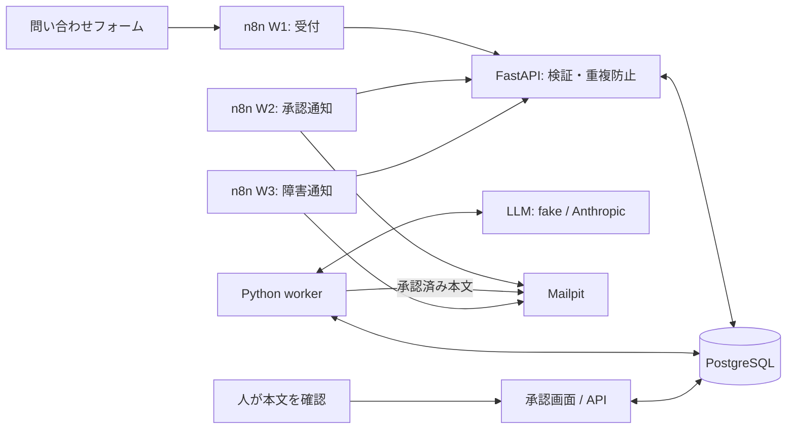

# 構成 / Architecture

P01は、B2B問い合わせの受付・見込み度評価・返信案作成に、人による本文確認を挟むローカルシステムです。実装と起動手順は[日本語README](../projects/p01-lead-automation/README.ja.md)、設計上の理由は[ケーススタディ](../projects/p01-lead-automation/docs/case-study.ja.md)にあります。

## 責任の境界

| 層 | 責任 | 公開コード |
|---|---|---|
| n8n | webhook、API呼び出し、承認依頼・障害通知。業務判断はPythonに置く | [workflows](../projects/p01-lead-automation/n8n/workflows)、[ADR](../projects/p01-lead-automation/docs/adr/0001-n8n-python-boundary.md) |
| FastAPI | schema validation、idempotency、確認画面、承認・編集・却下API | [main.py](../projects/p01-lead-automation/src/sales_ops/main.py)、[schemas.py](../projects/p01-lead-automation/src/sales_ops/schemas.py) |
| Python worker | claimしたjobの評価・下書き・送信、retry、最終失敗の記録 | [worker.py](../projects/p01-lead-automation/src/sales_ops/worker.py)、[jobs.py](../projects/p01-lead-automation/src/sales_ops/jobs.py) |
| PostgreSQL | 状態、job、下書き、承認、outbox、通知、LLM観測値。制約で本文の承認一致を守る | [tables.py](../projects/p01-lead-automation/src/sales_ops/tables.py)、[migrations](../projects/p01-lead-automation/migrations/versions) |
| Mailpit | ローカルのメール受信・テスト確認 | [compose.yaml](../projects/p01-lead-automation/compose.yaml) |

## 3つの検証ポイント

1. **受付:** 同じidempotency key/bodyを再送しても重複しません。違うbodyなら409。競合をDB制約で処理します。
2. **AI出力:** raw response → schema → domain validation → normalization。不正出力は`needs_review`へ回し、評価結果として保存しません。低confidenceも人へ回します。
3. **承認・送信:** 承認を本文SHA-256に結び付け、編集で承認を取り消します。送信時もDB制約とrow lockで確認します。

jobは`FOR UPDATE SKIP LOCKED`とleaseでclaimします。n8n通知もleaseでclaimし、状態変更と通知作成を同じtransactionへまとめます。SMTP成功とDB更新を原子的にはできないため、重複し得る停止位置を[制約](../evidence/p01/LIMITATIONS.md)で明示しています。

## 第三者が辿る順序

[入口README](../README.md) → [プロジェクト](../projects/p01-lead-automation/README.ja.md) → [テスト結果](../evidence/p01/TEST_RESULTS.md) → [壊れ方と修正](../evidence/p01/FAILURE_TO_FIX.md)。実APIの確認範囲は[API_SMOKE](../evidence/p01/API_SMOKE.md)を参照してください。

English: n8n connects systems; Python owns validation and state decisions; PostgreSQL owns durable state and constraints; human approval binds to the exact draft text; Mailpit is the local delivery boundary.
