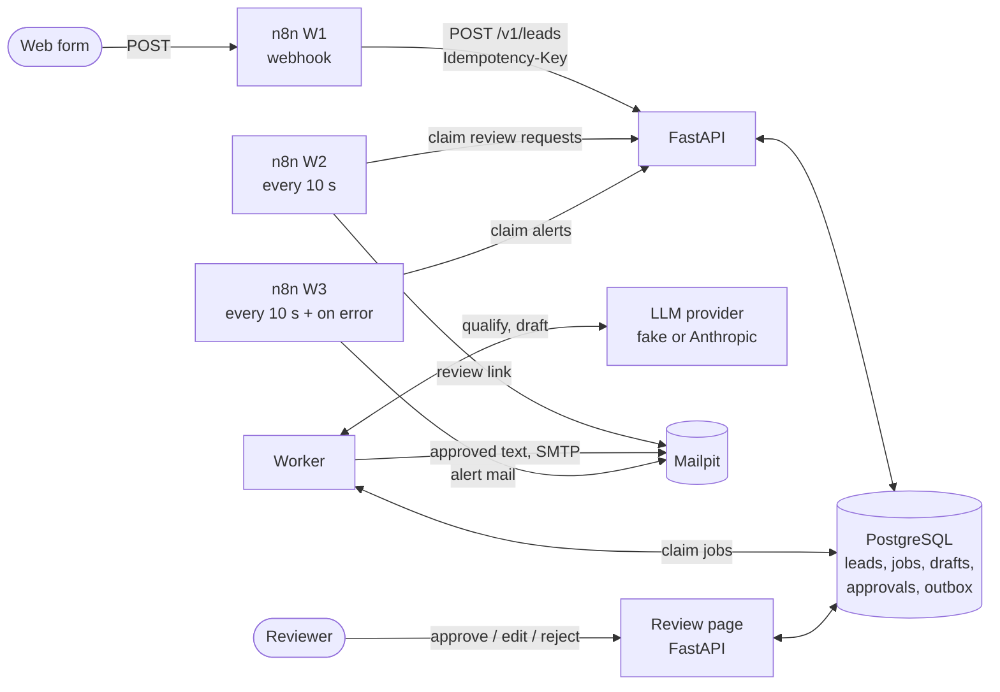
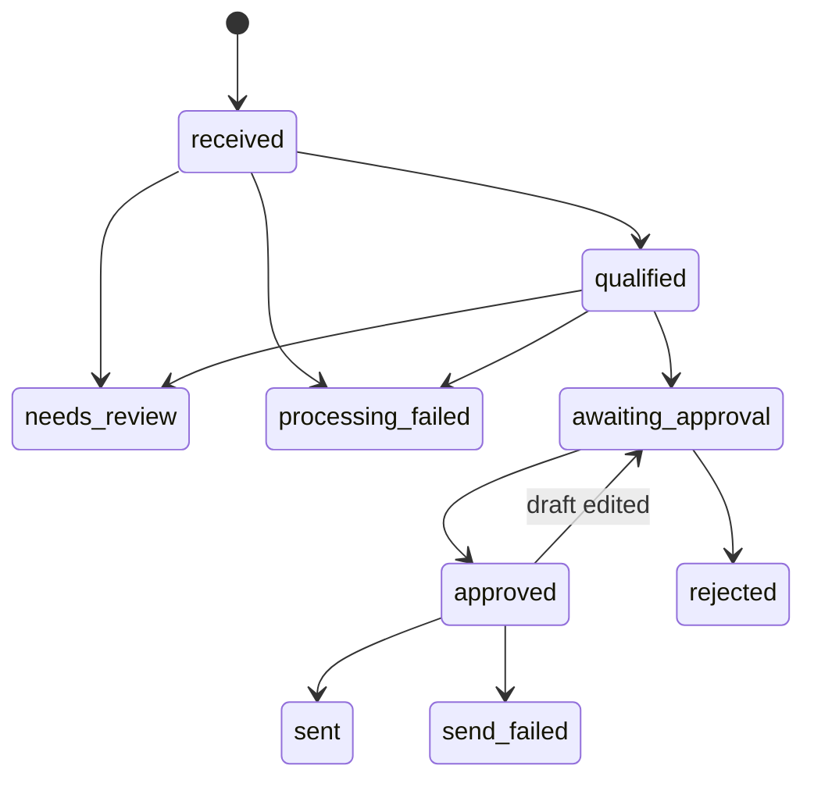

# AI Sales Operations Engine

English | [日本語](guide.ja.md)

Inbound B2B inquiries are qualified by an LLM, a follow-up is drafted, and a person approves the
exact text before anything is sent. A web form posts to n8n, FastAPI and a worker do the work
on PostgreSQL, and email goes to a local mail catcher. Portfolio project P01.

| Project ID | Portfolio slug | Product name | Python package |
|---|---|---|---|
| P01 | `p01-lead-automation` | AI Sales Operations Engine | `sales_ops` |

## What it shows

- **Idempotent intake.** A retried or duplicated form post never creates a second lead. The
  database settles races (`INSERT ... ON CONFLICT`), not "check, then insert".
- **LLM output treated as untrusted input.** Every answer goes through schema validation,
  domain rules and normalization. What fails goes to a person, never into the database.
- **A job queue on PostgreSQL** (`FOR UPDATE SKIP LOCKED` with leases). Several workers can
  run side by side, a crashed worker's job is taken over, and retries and alerts have limits.
- **Human approval bound to the exact text.** An approval names the sha256 of the draft the
  reviewer read, and database constraints make the sent email byte-for-byte that text.
- **Failure behavior that is tested and written down**, including the one case where a
  mail can go out twice, and why that trade-off was chosen.
- **A clear n8n/Python boundary.** n8n connects systems and sends notifications; Python makes
  every decision about a lead ([ADR-001](adr/0001-n8n-python-boundary.md)).

## Status

- The whole flow runs locally and is covered by `make e2e`, with the built-in **fake LLM
  provider**. The fake provider says in its output that no real model was called.
- The Anthropic adapter is tested against a mocked HTTP transport, and it has made real calls
  for the qualification step: 60 in the evaluation below, and one through the worker in the
  smoke test at the end. **Drafting has only run with the fake provider**, so the flow from
  inquiry to sent mail has not met a real model end to end.
- The qualification step was evaluated on 30 synthetic inquiries labeled by a person:
  Claude Sonnet 5 agreed with the person's tier on 40.0% of them, Claude Haiku 4.5 on 43.3%
  (see [Evaluation](#evaluation)).
- Deployed to a Linux VM on the same Mac that nothing outside it can reach (see
  [Deployment](#deployment)). Company enrichment is a stub with synthetic data.

## Architecture



A lead moves through these states. Every change goes through one function that refuses any
move not drawn here:



## Quickstart

Requirements: Docker with Compose v2, `make`, and [uv](https://docs.astral.sh/uv/).

```bash
git clone <repository-url> sales-ops && cd sales-ops
make up     # build and start PostgreSQL, API, worker, Mailpit and n8n; wait until healthy
make e2e    # form -> review mail -> approve -> customer mail; then an alert with the API down
make down   # stop everything (the data volumes are kept)
```

While it runs: Mailpit shows every email at http://127.0.0.1:8025, n8n runs at
http://127.0.0.1:5678, and the API at http://127.0.0.1:8000 (`/healthz`, `/docs`). All ports
are bound to 127.0.0.1.

To walk through it by hand, post a form, open the review mail in Mailpit, and follow its link:

```bash
curl -X POST http://127.0.0.1:5678/webhook/lead-form -H 'Content-Type: application/json' \
  -d '{"email": "jane@example.com", "name": "Jane", "company": "Example KK",
       "message": "We get 300 inquiries a month and want to answer faster."}'
```

## How it works

### Intake API

`POST /v1/leads` accepts one inquiry.

```bash
curl -X POST http://127.0.0.1:8000/v1/leads \
  -H 'Content-Type: application/json' \
  -H 'Idempotency-Key: form-submission-123' \
  -d '{"email": "jane@example.com", "name": "Jane", "message": "Please get in touch."}'
```

- `Idempotency-Key` is required. A retry with the same key and body returns the first
  response with `Idempotent-Replayed: true`; the same key with a different body returns 409.
- Body fields: `email`, `name`, `message` (required), `company`, `source` (optional).
  Unknown fields, over-long values and control characters (anything but tabs and line breaks,
  NUL included) are rejected with 422 and nothing is stored.
- One person (email compared trimmed and lowercased) is one lead; later inquiries attach to it.
- Races are settled by database constraints (`INSERT ... ON CONFLICT`), not by
  "check, then insert": 20 identical requests sent in parallel store exactly one lead.
- Every response carries `X-Request-ID`. Logs are one JSON object per line with the same
  `request_id`, and email addresses are masked (`j***@example.com`).

### Worker

`make up` also starts a worker (`python -m sales_ops.worker`). It qualifies each new lead,
drafts a follow-up for a qualified lead, and sends drafts a person approved.

- **LLM output is untrusted input.** Every response goes through
  raw response → schema validation → domain validation → normalization before anything is
  stored. A refusal, a truncated answer, broken JSON, a wrong field or type, an
  out-of-range value (e.g. `{"score": 999, "priority": "SUPER_HIGH"}`), or a control
  character such as NUL never reaches the assessment table: the lead goes to `needs_review`
  and the raw output is kept for a human. PostgreSQL text cannot hold NUL, so the kept copy
  shows each NUL as `␀`. Database CHECK constraints guard the same ranges as a last line of
  defense.
- The model supplies a judgment (score 0–100, reasons, summary, confidence). Deterministic
  rules decide what it means: the tier (hot ≥ 70, warm ≥ 40, cold below) and whether a human
  must look (confidence below 0.5).
- Rate limits, timeouts, provider 5xx and connection errors are retried with exponential
  backoff, up to 5 attempts. After that the lead becomes `processing_failed` and exactly one
  alert event is written. A bug in one job fails that job, not the worker.
- Jobs live in PostgreSQL and are claimed with `FOR UPDATE SKIP LOCKED` plus a lease, so
  several workers can run side by side and a crashed worker's job is picked up again.
- Every LLM call is recorded with provider, model, prompt version, token counts and latency.
- The prompt carries the email domain, the company and the inquiry text, but not the
  sender's name or email address. Inquiry text is delimited and treated as data.
- Drafts go through the same pipeline. On top of the schema, a draft must be ready to send
  as written: no placeholder such as `[Name]` or `{{first_name}}`, no control characters, a
  one-line subject. Otherwise the lead goes to `needs_review` with the raw output kept.
  Qualification, drafts, human edits and API input share one rule for control characters: any
  but tabs and line breaks makes the text invalid, checked before normalization, so none is
  dropped without a trace.
- Provider and model come from `LLM_PROVIDER` / `LLM_MODEL`; nothing is hard-coded.
  `LLM_PROVIDER=fake` (the default, used for development) and `anthropic` exist. Company
  enrichment is a stub with synthetic data.

### n8n workflows

n8n handles the connections between systems. Python keeps every decision about a lead: which
input is valid, which request is a repeat, which state a lead may move to, what counts as an
approval. [ADR-001](adr/0001-n8n-python-boundary.md) explains where the line is and why.

| Workflow | Trigger | What it does |
|---|---|---|
| W1 inbound | `POST http://127.0.0.1:5678/webhook/lead-form` | Shapes the form, adds an `Idempotency-Key` computed from the exact body, and posts it to `/v1/leads`. The sender gets the API's answer: 201, or 422 for invalid input such as a bad email or a control character. A 5xx, or an API that cannot be reached, fails the run and becomes an alert. |
| W2 review mail | every 10 s | Claims review requests from the API and mails `reviewers@sales-ops.example` a link to the review page, then marks each one delivered. |
| W3 alerts | a failed W1/W2 run, and every 10 s | Mails `alerts@sales-ops.example` when an n8n workflow fails, and for each failure the app recorded (`processing_failed`, `send_failed`). |

```bash
curl -X POST http://127.0.0.1:5678/webhook/lead-form -H 'Content-Type: application/json' \
  -d '{"email": "jane@example.com", "name": "Jane", "company": "Example KK", "message": "Hello"}'
```

- The workflows in `n8n/` are the source of truth. On every start, n8n imports and publishes
  them, so nothing has to be clicked in the UI. An edit made only in the n8n UI is overwritten
  on the next restart; change the JSON instead (`tests/test_n8n_workflows.py` checks it).
  `make n8n-status` shows the result from n8n itself, with no login or API key: the CLI's list
  of workflows, the active count in `/metrics`, and W1's webhook registration.
- Python writes a review request or an alert in the same transaction as the state change that
  causes it. n8n claims a batch for a 60-second lease, sends, and marks each one delivered.
  Delivery is at-least-once, and two overlapping polls never claim the same item.
- A poll that cannot reach the API is skipped until the next tick, so an outage does not send
  an alert every 10 seconds. A failed form post does raise one.
- n8n keeps little of what passes through it. A successful run is soft-deleted as soon as it
  finishes, and n8n removes it after its one-hour buffer; until then the row still holds the
  run's start data, which for W1 is the form post. Failed runs keep their data for debugging
  and are pruned after 14 days (n8n's default). What W2 and W3 claim is never stored.
- Telemetry, version checks and templates are switched off with the settings n8n documents for
  keeping an instance from contacting n8n's servers ("Isolate n8n"). The Mailpit SMTP
  credential has no login, so the repository holds no secret.

### Review page

The review mail links to `http://127.0.0.1:8000/review/<lead_id>`. The page shows the
assessment and the draft, and has forms to approve, reject, or edit and save a new version.

- Each form carries the sha256 of the draft the reviewer saw. If the draft changed in the
  meantime, the form is refused (409) and the page shows the current text. A form posted from
  another site cannot know the text, so it cannot approve or reject anything.
- Everything taken from an inquiry or a draft is HTML-escaped. The page loads nothing from
  elsewhere, and it refuses to be framed (Content-Security-Policy).
- Opening the page changes nothing; only the forms do.

### Review API

A drafted lead waits in `awaiting_approval`. Nothing is sent until a person approves exactly
the text they read.

```bash
# Status, assessment, the current draft and its sha256
curl http://127.0.0.1:8000/v1/leads/$LEAD_ID
# Approve the text you read, named by its sha256
curl -X POST http://127.0.0.1:8000/v1/leads/$LEAD_ID/approve -H 'Content-Type: application/json' \
  -d '{"draft_sha256": "<sha256 from GET>", "approved_by": "alice"}'
# Or edit it (a new version), or reject the lead
curl -X PUT http://127.0.0.1:8000/v1/leads/$LEAD_ID/draft -H 'Content-Type: application/json' \
  -d '{"subject": "...", "body": "...", "edited_by": "alice"}'
curl -X POST http://127.0.0.1:8000/v1/leads/$LEAD_ID/reject -H 'Content-Type: application/json' \
  -d '{"rejected_by": "alice", "reason": "not a fit"}'
```

- An approval names the sha256 of the text the reviewer read. If the draft changed in the
  meantime, approve returns 409 and nothing is approved.
- Editing an approved draft revokes the approval, and the lead waits for a new one. Once
  sending has started, the draft can no longer change (409).
- Approving the same text again, or rejecting again, changes nothing: a double click is safe.
- An edit or a reject reason with a control character (anything but tabs and line breaks) is
  refused with 422, and nothing changes.
- Reading never changes anything; every change is a PUT or POST, so a mail client that
  prefetches links cannot approve by accident.
- There is no authentication yet: the reviewer name is whatever the caller sends, and the
  API listens on 127.0.0.1 only. Deployment (M6) has to add it.

### Sending

- The worker sends over SMTP to Mailpit only. Any other SMTP host is refused at startup.
- Before sending, the worker locks the lead row and checks that the lead is approved and that
  the approval is bound to the current draft. It writes an outbox row, sends, then marks the
  row sent. A lead that is not approved, or was rejected, gets nothing.
- The database enforces the binding as well: a stored draft's hash must equal the hash of its
  text, an approval can only carry the hash of the draft it approves, and an outbox row's text
  must hash to its approval's hash. The email that goes out is the text a person approved.
- SMTP 4xx replies (at any step, including a refused recipient) and connection errors are
  retried with the same Message-ID. A 5xx reply is not retried. When sending gives up, the
  lead becomes `send_failed` and exactly one alert event is written.

## Testing

```bash
make test        # the test suite, against the compose PostgreSQL and Mailpit
make check       # lint + format check + type check + secret scan + tests (what CI runs)
make e2e         # the whole flow on the running stack, including an alert with the API down
make n8n-status  # n8n shows W1-W3 imported and active (CLI, /metrics, webhook registration)
```

- Tests run against a real PostgreSQL and a real SMTP catcher, never a mock database. A
  missing database or Mailpit fails the tests; it never skips them.
- Emails are counted through Mailpit's API, per recipient. Every test uses addresses of its
  own, so the counts cannot mix.
- Concurrency is tested for real: parallel identical requests, two workers on one queue,
  ten approvals at once, and a re-approval while a send is in flight.
- The lead state machine is tested as a table of all 81 moves between the 9 states.
- Database constraints are tested directly, as if a bug had bypassed the code.
- `tests/test_n8n_workflows.py` reads the workflow JSON and checks it against the API: every
  URL is a real route, the idempotency key hashes exactly the body that is sent, and the alert
  workflow is published.
- The tests themselves were checked by breaking the code on purpose, one defense at a time,
  and confirming that a test failed.

## Evaluation

`make eval` qualifies the 30 synthetic inquiries in `eval/dataset.csv` and compares the
model's tier with the tier a person gave each one. The report covers agreement (overall, by
kind of inquiry, and as a confusion matrix), p50/p95 latency, and cost per lead.

- The labels come from a person, not a model. They are written before any model is evaluated
  and frozen with `make eval-freeze`, which records the file's sha256
  ([eval/LABELING.md](../eval/LABELING.md)).
- By default `make eval` uses the fake provider, which checks the harness and measures no
  model. A real model runs only when the labels are frozen, prices are set, and
  `EVAL_BUDGET_USD` covers the worst-case cost of the whole run, all checked before any call.
  Each real report lists any call whose prompt used more tokens than that check assumed.

Results of 2026-09-27: one run per model, prompt `qualify-v1`, output limit 2048 tokens (the
worker uses 4096). The reports are in [eval/reports/](../eval/reports/).

| Model | Agreement | Latency p50 / p95 | Cost per lead | Sent to review |
|---|---|---|---|---|
| Claude Sonnet 5 | 40.0% (12 of 30) | 4.4 s / 8.3 s | $0.0045 | 4 |
| Claude Haiku 4.5 | 43.3% (13 of 30) | 2.4 s / 4.6 s | $0.0011 | 1 |

Both models gave a valid answer for all 30, and no call needed a retry. Mean tokens per call
were 696 in and 306 out for Sonnet 5, and 541 in and 116 out for Haiku 4.5. Almost every disagreement was the model rating a
lead lower than the person did (17 of 18 for Sonnet 5, 15 of 17 for Haiku 4.5). Neither model
agreed with the person on any of the six inquiries written with conflicting data. Thirty
inquiries and one person's labels are a small sample: these numbers describe this set, not
the models in general.

## Failure cases

| What happens | Result |
|---|---|
| LLM rate limit, timeout, 5xx, dropped connection | Retried with backoff; after 5 attempts `processing_failed` and one alert |
| LLM output unusable (refusal, truncation, bad JSON, wrong schema, a control character such as NUL, placeholder in a draft) | `needs_review`, raw output kept, no retry |
| A worker crashes in the middle of a job | Its lease runs out and another worker takes the job over |
| A send job runs again (re-run, double approval, takeover before the SMTP send) | Nothing is sent twice: the outbox row is found, and it is marked sent |
| The draft changes after approval | The approval is revoked; nothing is sent until the new text is approved |
| SMTP 4xx or connection error | Retried with the same Message-ID |
| SMTP 5xx, or sending keeps failing | `send_failed` and one alert |
| The database fails right after the SMTP server accepted the mail | The record is retried. A mail that went out is never recorded as `send_failed`; if the database stays down, the job waits for its lease like a crash (next row) |
| **The worker dies after the SMTP server accepted the mail, before the outbox row is marked sent** | **The mail is sent twice** (known limit, below) |
| The API is down when a form is posted | The form gets HTTP 500 and W3 mails an alert naming the failed step. Nothing is stored; the sender must post again |
| n8n stops after sending a review mail or an alert, before marking it delivered | The item is sent again once its 60-second lease runs out |
| n8n is down | Form posts fail until it is back. Review requests and alerts wait in the database and go out when it returns |

### Known limit: a crash between SMTP and the database record can send twice

Sending is at-least-once. The worker writes the outbox row before it sends and marks it sent
after the SMTP server has accepted the mail. If the process dies between those two steps, or
stalls for longer than its lease (5 minutes), the next worker finds a row that is not marked
sent. It cannot tell whether the first attempt reached the server, so it sends again.

Both copies carry the same Message-ID, so a receiver that deduplicates by Message-ID can drop
the second one. Mailpit keeps both. The test
`test_known_limit_a_crash_between_smtp_and_the_record_sends_twice_with_one_message_id`
reproduces this case.

Closing the window completely needs an idempotent receiver: one that deduplicates by
Message-ID, or a mail API that accepts an idempotency key. The opposite choice, marking the
row sent before sending, would turn the same crash into a lost email. For a sales follow-up, a
rare duplicate is the smaller harm.

## Security

- **Local only.** Every port is bound to 127.0.0.1, and mail goes only to Mailpit: the worker
  refuses any other SMTP host at startup.
- **No authentication.** The review page, the review API and the endpoints n8n polls are
  open to anyone who can reach 127.0.0.1. The deployment below has none either, because
  nothing outside its VM can reach it. A host that others can reach needs authentication first.
- **Secrets stay out of the repository.** API keys live in `.env`, which git ignores.
  `make check` scans every tracked file for credential-shaped strings, and the n8n SMTP
  credential has no login. Database credentials in `compose.yaml` are local defaults.
- **Prompt injection.** Inquiry text is wrapped in delimiters and the prompt says to treat it as
  data. Whatever the model returns still has to pass schema and domain validation, and it can
  only suggest a score; deterministic rules decide what the score means.
- **Less personal data to the LLM.** The prompt carries the email domain, the company and the
  inquiry, not the sender's name or email address. Logs mask email addresses.
- **Approval integrity.** The approved sha256 is checked under a row lock and enforced by
  database constraints (hash CHECKs, composite foreign keys). A stale page, or a form posted
  from another site, cannot approve or reject: it does not know the text.
- **The review page** escapes everything taken from inquiries and drafts, loads nothing from
  elsewhere, and refuses to be framed (Content-Security-Policy).
- **n8n** runs with telemetry, version checks and templates switched off, and keeps no data
  from successful runs beyond n8n's one-hour deletion buffer.

## Deployment

The deployment target is a Linux VM on the same Mac, separate from Docker Desktop: Ubuntu
24.04 under [Lima](https://lima-vm.io/) 2.2, defined in [deploy/vm/lima.yaml](../deploy/vm/lima.yaml).
Nothing in it is reachable from outside the VM: Lima forwards none of its ports to the Mac and
shares no folder with it. There is no public URL and no live demo. The LLM is the fake
provider, and all mail goes to Mailpit.

```bash
~/.local/lima/bin/limactl start --name=p01-vm --tty=false deploy/vm/lima.yaml   # once
make vm-deploy   # copy the images and the config in, migrate, start, wait until healthy
make vm-e2e      # the e2e checks, run inside the VM
```

- **The same images.** `make vm-deploy` builds the app image on the Mac and copies it and the
  three service images into the VM. It stops unless every image has the same content on both
  sides (its linux/arm64 manifest digest). The Mac's stack and the VM's differ in settings only.
- **Secrets.** The first deploy generates the database password inside the VM and keeps it in
  `/etc/sales-ops/secrets.env`, readable by root only and outside git. A search for it in the
  four images, the logs and this repository found it in none of them.
- **Migrations on every deploy.** A one-shot `migrate` service runs `alembic upgrade head`
  before the api and the worker start. Deploying twice in a row works; the second run finds
  nothing to migrate.
- **Health.** The api's health check is `/healthz`, which queries the database. With
  PostgreSQL stopped it answers 503 and the container turns unhealthy; both recover when the
  database is back.
- **Restarts.** Docker restarts a killed api or worker process. The api answered `/healthz`
  again about a second after it was killed.
- **Tracing.** Every request line carries a `request_id`, and the lead it creates is named by
  its `lead_id` in the worker's lines, so one request can be followed to the sent mail.
- **Recovery.** A worker killed in the middle of a send left its job leased. When the lease ran
  out (five minutes), the restarted worker took the job over, and the customer got one mail,
  with the Message-ID recorded before the crash. The crash came before the SMTP server accepted
  the mail; a crash after that point sends it twice (see Failure cases).

## Known limitations

- **Company enrichment is a stub.** Three synthetic company profiles stand in for a real
  enrichment API.
- **Drafting has not met a real model.** Qualification has: 60 calls in the evaluation and
  one through the worker in the smoke test. Drafting has only run with the fake provider.
- **A small evaluation.** 30 synthetic inquiries, one person's labels, one run per model.
  Agreement with that person was 40–43%, lowest on inquiries with conflicting data.
- **No authentication**, and the deployment is a local VM, not a host others can reach.
- **At-least-once sending.** A crash between the SMTP send and the database record sends the
  mail twice (see Failure cases).
- **Notifications by polling.** Review and alert emails leave up to about 10 seconds after the
  event, and can arrive twice if n8n stops between sending and marking them delivered.
- **English UI and notifications.** The review page and n8n's emails are in English.
  Japanese documentation is available in [README.ja.md](guide.ja.md). The drafting
  prompt asks for the inquiry's language, but drafting has only run with the fake provider,
  which always writes English, so whether a real model follows it is untested.
- Not in scope: CRM integration, a dashboard, real company data.

## Real provider smoke test (AC-2.7)

Provider and model were chosen in UD-4: Anthropic, `claude-sonnet-5`. The canonical runtime for
development is the fake provider; only this target calls the real API, once, with synthetic
test data.

**Result of 2026-09-27:** one real call qualified one synthetic lead through the worker (HTTP
200, 736 input and 462 output tokens, $0.0061, 6.8 s; score 82, tier hot, confidence 0.6). The
worker's record of the call held the provider, model, prompt version, token counts, cost and
latency. It covers qualification only: drafting has not run on a real model.

Put the line `ANTHROPIC_API_KEY=<your key>` into `.env` with a text editor. The file is
git-ignored; typing the key on the command line would leave it in your shell history. Then:

```bash
make smoke-live   # qualifies one synthetic lead: exactly one call (drafting is not part of it)
```

- The SDK's own retries are off (`max_retries=0`); the worker owns retries, so every HTTP
  attempt is recorded with its outcome, HTTP status, tokens, cost and timestamps.
- When the provider reports no usage (timeout, 429, network error), tokens and cost are stored
  as NULL, meaning unknown. Database constraints make recording them as 0 impossible.
- Structured output is requested, but the answer is still validated like any untrusted input.
